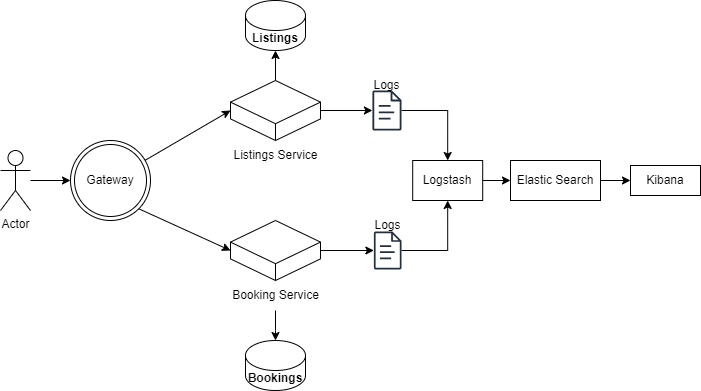

## Home Rental App (Microservice Architecture)

### 1. Why choose Microservices?
In an application related to home rental, we have the possibility of separating the functionalities of the system by dividing them into microservices with certain boundaries. This can be done to achieve some benefits:

* **Scalability**
A system used for home rentals can encounter variations in the use of microservices. At one point the number of bookings can grow substantially compared to the number of user that are registering. So, for this purpose, the booking service can be scaled whilst keeping the rest of the application at the same scale.
* **Flexibility**
If there is a need to add some new functionalities to the application such as a messaging system, a new service can just be added, without it affecting the rest of the application.
*  **Fault isolation**
If there are faults at one of the services, it should not impact the rest of the application.

### 2. Service Boundaries
**User Management Service**: This service handles user registration, login, profile updates, password resets.

**Listing Service**:  This service manages the creation, editting, and viewing of the property listings.

 **Booking Service**: This service handles reservations, availability checks, booking requests and booking history. It ensures that bookings are correctly made and updates availability accordingly.

 **Review and Rating Service**: This service manages reviews and ratings for properties and hosts. Users can leave reviews and ratings for properties they have stayed in. It also calculates and displays overall ratings for properties and hosts.


### 3. Endpoints

### User Service
- Login
```
Endpoint: user/login
Method: POST
Payload: 
{
    "email" : "user@mail.com",
    "password" : "132eQws1"
}
Response: 
{
    "access_token": "frfrrfer394478",
    "user_id": 123
}
```

- Register
```
Endpoint: user/register
Method: POST
Payload: 
   {  
   "email":  "user@mail.com",  
   "username":  "user", 
   "phone":  "067139254", 
   "password":  "132eQws1", 
   "first_name":  "Chris",  
   "last_name":  "Chilli"  }
Response: 
   {
    "user_id": 123
   }
```
- View User Profile
```
Endpoint: /user/123
Method: GET
Payload: {}
Response:
	{
	"id": 123,
    "username": "user",
    "location": "Paris",
    "user_rating" : 5
	}
```

- Delete User 
Needs **Header Authorization** with authorization token
```
Endpoint: /user/123/delete
Method: DELETE
Payload: 
	{
	"password" : "132eQws1"
	}
Response:
	{
	"message" : "User has been deleted"
	}
```
- Update Profile
Needs **Header Authorization** with authorization token
```
Endpoint: /user/123/edit
Method: PATCH
Payload: 
	{
	"first_name":  "Christ"
	}
Response:
	{
	"message" : "Profile has been updated"
	}
```
### Listing Service
- Create a Listing
Needs **Header Authorization** with authorization token
```
Endpoint: /listings/create
Method: POST
Payload: 
	{
	  "name": "Unit in Barcelona",
	  "location": "Barcelona",
	  "user_id": 123,
	  "price": 190,
	  "description": "A cozy unit in the heart of Barcelona.",
	  "amenities": ["WiFi", "Air conditioning", "Kitchen"],
	  "images": ["image1.jpg", "image2.jpg"],
	  "availability": {
	    "2023-09-25": {
	      "available": true,
	      "price": 150
	    }
	  }
	}

Response: 
   {
    "listing_id" : 12345
   }
```
At this point, in the listing cache, the username will be stored along the listing_id to simplify retreival.

- Update listing
Needs **Header Authorization** with authorization token
```
Endpoint: /listings/12345/update
Method: PATCH
Payload: 
	{
	   availability:{
	    "2023-09-25": {
	      "available": false
	    }
	  }
	}

Response: 
   {
    "message":"Listing has been modified"
   }
```

- View Listing
```
Endpoint: /listings/12345
Method: GET
Payload: {}
Response: 
 	{
	  "name": "Unit in Barcelona",
	  "location": "Barcelona",
	  "rating" : 5,
	  "user_name": "user",
	  "price": 190,
	  "description": "A cozy unit in the heart of Barcelona.",
	  "amenities": ["WiFi", "Air conditioning", "Kitchen"],
	  "images": ["image1.jpg", "image2.jpg"],
	  "availability": {
	    "2023-09-25": {
	      "available": true,
	      "price": 150
	    }
	    ...
	  }
	}
```
- View all listings in a location
```
Endpoint: /listings/Barcelona
Method: GET
Payload: {}
Response: 
 	{
 	"listings":{
 	  {
		  "listing_id": 12345
		  "name": "Unit in Barcelona",
		  "location": "Barcelona",
		  "user_name": "user",
		  "price": 190,
	  },
	  {
		  ...
	  }
	}
```
 ### Booking service
 - Check availability
```
Endpoint:  /bookings/check-availability
Method: POST
Payload:
{
  "listing_id": "12345",
  "dates": {
    "start_date": "2023-10-01",
    "end_date": "2023-10-05"
  }
}
Response:
{
  "available": true
  "price" : 560
}
```
- Book 
Needs **Header Authorization** with authorization token
```
Endpoint:  /bookings/book
Method: POST
Payload:
{
  "listing_id": "12345",
  "user_id": "67890",
  "payment_method" : "credit card",
  "dates": {
    "start_date": "2023-10-01",
    "end_date": "2023-10-05"
  }
}
Response:
{
  "success": true,
  "booking_id": 56789
}
```
- View a booking
Needs **Header Authorization** with authorization token
```
Endpoint: /bookings/56789
Method: GET
Payload:{}
Response:
{
 "listing_id": "12345",
 "user_id": "67890",
 "payment_method" : "credit card",
 "price": 560,
 "dates": {
    "start_date": "2023-10-01",
    "end_date": "2023-10-05"
    }
  "name": "Unit in Barcelona",
  "location": "Barcelona",
  "rating" : 5,
  "user_name": "user",
  "description": "A cozy unit in the heart of Barcelona.",
  "amenities": ["WiFi", "Air conditioning", "Kitchen"],
  "images": ["image1.jpg", "image2.jpg"]
  }
}
```
- View past bookings of a user
Needs **Header Authorization** with authorization token
```
Endpoint: /bookings/user/123
Method: GET
Payload:{}
Response:
{
 	"bookings":{
 	  {
		  "listing_id": 12345
		  "name": "Unit in Barcelona",
		  "location": "Barcelona",
		  "user_name": "user",
		  "price": 560,
	  },
	  {
		  ...
	  }
	}
```
### Rate and Review Service

- Rate and Review a listing
Needs **Header Authorization** with authorization token
```
Endpoint:  /reviews/review/12345
Method: POST
Payload:
{
  "user_id": "67890",
  "rating" : 5
  "review" : "Nice place"
}
Response:
{
  "success": true,
  "message" : "review submitted successfully"
}
```
- Get a listing's reviews
```
Endpoint:  /reviews/listing/12345
Method: GET
Payload:
{}
Response:
{
  "reviews" :  {  
     { 
	     "user_name" : "user"
	     "rating": 5
	     "review" : "Nice place" 
     },
     {
     ...
     }
      
}
```
- Get a host's overall rating

```
Endpoint:  /reviews/user/123/rating
Method: GET
Payload:
{}
Response:
{
  "rating" : 4.45   
}
```
- Get a listing's overall rating

```
Endpoint:  /reviews/listing/12345/rating
Method: GET
Payload:
{}
Response:
{
  "rating" : 4.11  
}
```

### Technology stack
1. For the services: ASP.NET Core (C#) with database in MSSQL
2. For the gateway: Flask(Python) - suitable for working with REST API
3. Communication will be handled through REST APIs.
4. Caching at the level of services will be done through Redis

### Deployment and Scaling
It is planned to deploy the system using _Docker_.
